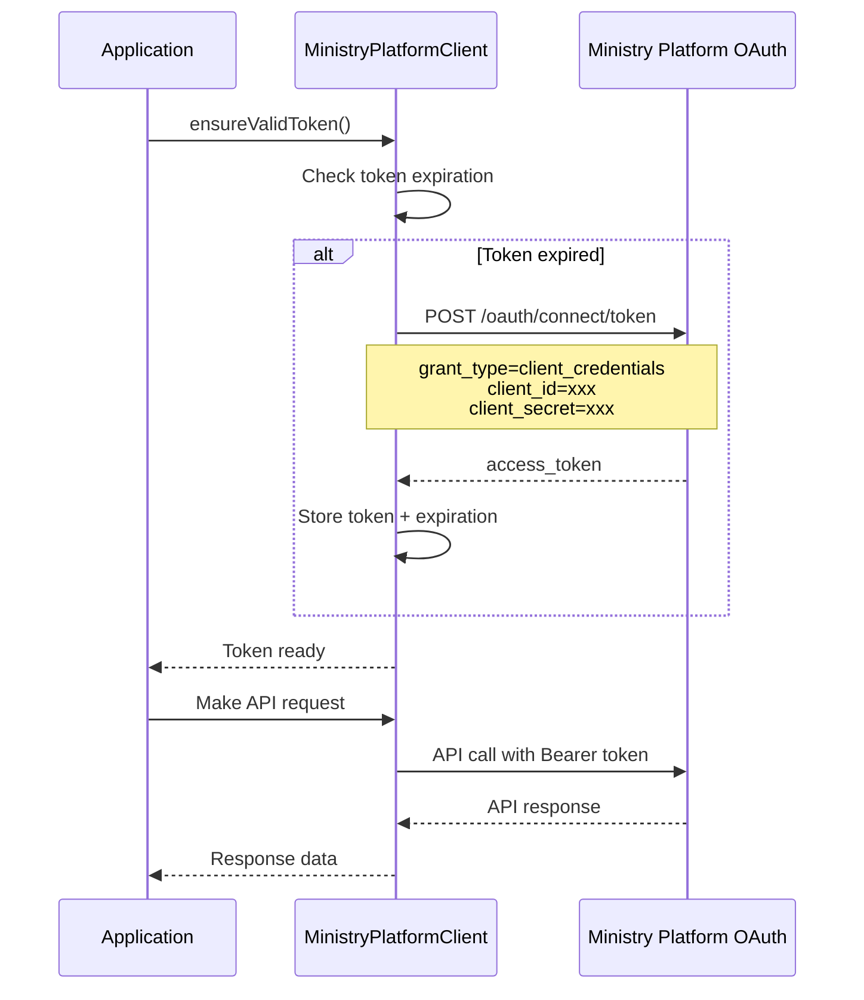
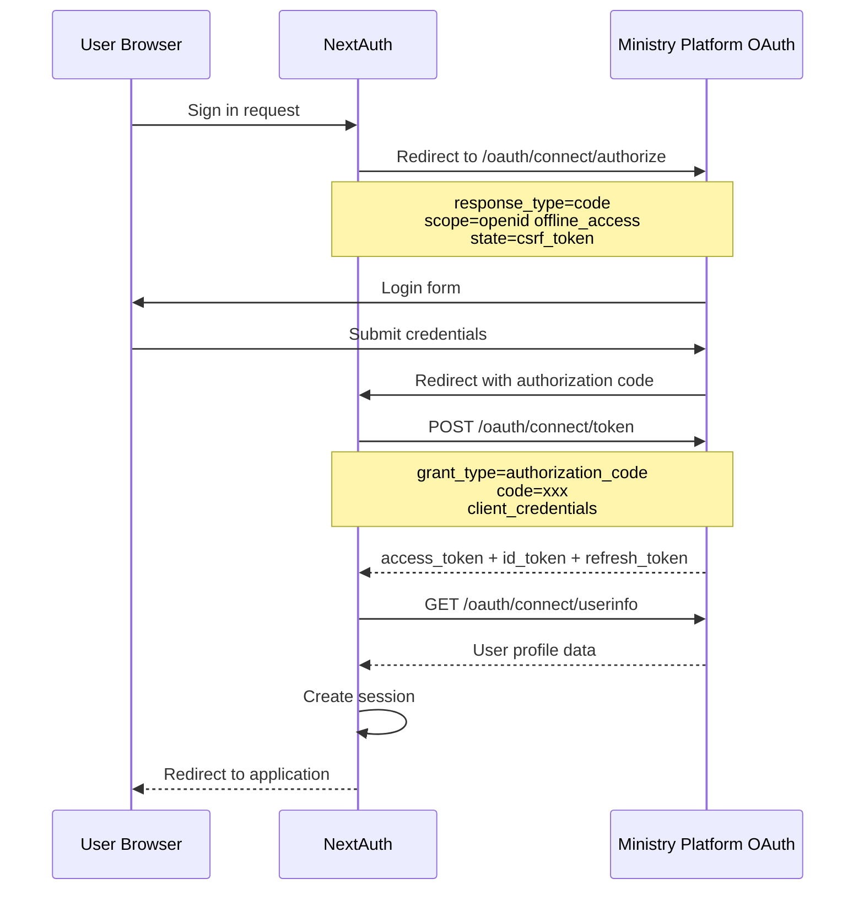

# Ministry Platform Authentication Documentation

## Overview

The Ministry Platform provider implements a dual authentication system that handles both API access (client credentials) and user authentication (OAuth2 authorization code flow). This documentation covers both authentication mechanisms and their integration with NextAuth.

## Authentication Architecture

```
┌─────────────────────────────────────────────────────────────┐
│                    Application Layer                        │
├─────────────────────────────────────────────────────────────┤
│  NextAuth Session Management + Ministry Platform Provider   │
├─────────────────────────────────────────────────────────────┤
│         User Authentication     │    API Authentication     │
│    (Authorization Code Flow)    │  (Client Credentials Flow) │
│                                 │                           │
│  ministryPlatformAuthProvider   │    clientCredentials.ts   │
│         ↓                       │         ↓                 │
│  OAuth2 + OpenID Connect        │   OAuth2 Client Creds     │
└─────────────────────────────────────────────────────────────┘
                              ↓
                    Ministry Platform OAuth Server
```

## API Authentication (Client Credentials)

### clientCredentials.ts

```typescript
export async function getClientCredentialsToken() {
  const mpBaseUrl = process.env.MINISTRY_PLATFORM_BASE_URL!;
  const mpOauthUrl = `${mpBaseUrl}/oauth`;

  const params = new URLSearchParams({
    grant_type: "client_credentials",
    client_id: process.env.MINISTRY_PLATFORM_CLIENT_ID!,
    client_secret: process.env.MINISTRY_PLATFORM_CLIENT_SECRET!,
    scope: "http://www.thinkministry.com/dataplatform/scopes/all",
  });

  const response = await fetch(`${mpOauthUrl}/connect/token`, {
    method: "POST",
    headers: {
      "Content-Type": "application/x-www-form-urlencoded",
    },
    body: params.toString(),
  });

  if (!response.ok) {
    throw new Error(`Failed to get client credentials token: ${response.statusText}`);
  }

  return await response.json(); // returns { access_token, expires_in, token_type, ... }
}
```

**Purpose**: Provides server-to-server authentication for API operations

**OAuth2 Flow**: Client Credentials Grant
- **Grant Type**: `client_credentials`
- **Scope**: `http://www.thinkministry.com/dataplatform/scopes/all`
- **Authentication**: Client ID and Client Secret

**Usage**: Used by `MinistryPlatformClient` for all API operations

**Environment Variables Required**:
```env
MINISTRY_PLATFORM_BASE_URL=https://your-instance.ministryplatform.com
MINISTRY_PLATFORM_CLIENT_ID=your_client_id
MINISTRY_PLATFORM_CLIENT_SECRET=your_client_secret
```

**Token Response**:
```json
{
  "access_token": "eyJhbGciOiJSUzI1NiIs...",
  "expires_in": 3600,
  "token_type": "Bearer",
  "scope": "http://www.thinkministry.com/dataplatform/scopes/all"
}
```

**Error Handling**:
```typescript
try {
  const tokenResponse = await getClientCredentialsToken();
  console.log('Token acquired successfully');
} catch (error) {
  console.error('Token acquisition failed:', error.message);
  // Handle authentication errors
  // - Check client credentials
  // - Verify Ministry Platform connectivity
  // - Check OAuth configuration
}
```

## User Authentication (NextAuth Provider)

### ministryPlatformAuthProvider.ts

```typescript
export interface MinistryPlatformProfile {
  display_name: string
  family_name: string
  given_name: string
  middle_name?: string
  nickname?: string
  email: string
  sub: string
  name?: string
  user_id?: string
}

export default function MinistryPlatform<P extends MinistryPlatformProfile>(
  options: OAuthUserConfig<P>
): OAuthConfig<P> {
  const mpBaseUrl = process.env.MINISTRY_PLATFORM_BASE_URL
  const mpOauthUrl = `${mpBaseUrl}/oauth`
  
  return {
    id: "ministryplatform",
    name: "MinistryPlatform",
    type: "oauth",
    wellKnown: `${mpOauthUrl}/.well-known/openid-configuration`,
    issuer: mpOauthUrl,
    authorization: {
      url: `${mpOauthUrl}/connect/authorize`,
      params: {
        scope: "openid offline_access http://www.thinkministry.com/dataplatform/scopes/all",
        response_type: "code",
        realm: "realm",
      },
    },
    token: {
      url: `${mpOauthUrl}/connect/token`,
      params: {
        grant_type: "authorization_code",
      },
    },
    userinfo: {
      url: `${mpOauthUrl}/connect/userinfo`,
    },
    checks: ["state"],
    profile(profile) {
      return {
        id: profile.sub,
        name: `${profile.given_name} ${profile.family_name}`,
        firstName: profile.given_name,
        lastName: profile.family_name,
        email: profile.email,
        image: null,
        sub: profile.sub,
        userId: profile.sub,
        username: profile.name,
        user_id: profile.user_id
      }
    },
    options,
  }
}
```

**Purpose**: Provides user authentication for login and session management

**OAuth2 Flow**: Authorization Code Grant with PKCE
- **Grant Type**: `authorization_code`
- **Scope**: `openid offline_access http://www.thinkministry.com/dataplatform/scopes/all`
- **Response Type**: `code`
- **Security**: State parameter for CSRF protection

**Key Features**:
- **OpenID Connect**: Full OIDC implementation with discovery
- **Offline Access**: Refresh token support
- **Profile Mapping**: Maps Ministry Platform user info to NextAuth format
- **Well-Known Configuration**: Automatic endpoint discovery

### NextAuth Integration

#### Configuration (auth.ts)

```typescript
import { NextAuthConfig } from "next-auth"
import MinistryPlatform from "@/providers/MinistryPlatform/ministryPlatformAuthProvider"

export default {
  providers: [
    MinistryPlatform({
      clientId: process.env.MINISTRY_PLATFORM_CLIENT_ID!,
      clientSecret: process.env.MINISTRY_PLATFORM_CLIENT_SECRET!,
    }),
  ],
  callbacks: {
    async jwt({ token, account, profile }) {
      // Persist Ministry Platform user info in JWT
      if (account && profile) {
        token.sub = profile.sub
        token.user_id = profile.user_id
        token.accessToken = account.access_token
        token.refreshToken = account.refresh_token
      }
      return token
    },
    
    async session({ session, token }) {
      // Add Ministry Platform info to session
      session.user.id = token.sub
      session.user.userId = token.user_id
      session.accessToken = token.accessToken
      return session
    },
  },
  pages: {
    signIn: '/auth/signin',
    error: '/auth/error',
  },
} satisfies NextAuthConfig
```

#### Session Usage

```typescript
import { useSession } from "next-auth/react"

export default function UserProfile() {
  const { data: session, status } = useSession()
  
  if (status === "loading") return <p>Loading...</p>
  if (status === "unauthenticated") return <p>Access Denied</p>
  
  return (
    <div>
      <h1>Welcome {session.user.name}</h1>
      <p>Email: {session.user.email}</p>
      <p>User ID: {session.user.userId}</p>
    </div>
  )
}
```

## Authentication Flow Diagrams

### Client Credentials Flow (API Access)



### Authorization Code Flow (User Login)



## Token Management

### Token Lifecycle

```typescript
export class MinistryPlatformClient {
    private token: string = "";
    private expiresAt: Date = new Date(0);
    
    public async ensureValidToken(): Promise<void> {
        if (this.expiresAt < new Date()) {
            const creds = await getClientCredentialsToken();
            this.token = creds.access_token;
            this.expiresAt = new Date(Date.now() + TOKEN_LIFE);
        }
    }
}
```

**Token Refresh Strategy**:
- **Proactive Refresh**: Tokens refreshed 5 minutes before expiration
- **Automatic Retry**: Failed requests trigger token refresh
- **Shared Instance**: Single token serves all API operations
- **Thread Safety**: Token refresh is atomic

### Session Token vs API Token

| Aspect | Session Token (User Auth) | API Token (Client Creds) |
|--------|---------------------------|---------------------------|
| **Purpose** | User authentication & authorization | API access for operations |
| **Lifetime** | Session duration (hours/days) | Short-lived (1 hour) |
| **Refresh** | NextAuth handles refresh tokens | Auto-refresh before expiry |
| **Scope** | User permissions & profile | Full API access |
| **Storage** | Encrypted session cookie | Memory (not persisted) |

## Security Considerations

### Environment Variables

```env
# Required for both authentication flows
MINISTRY_PLATFORM_BASE_URL=https://your-instance.ministryplatform.com
MINISTRY_PLATFORM_CLIENT_ID=your_application_client_id
MINISTRY_PLATFORM_CLIENT_SECRET=your_application_client_secret

# NextAuth configuration
NEXTAUTH_URL=http://localhost:3000
NEXTAUTH_SECRET=your_nextauth_secret_key

# Production considerations
AUTH_TRUST_HOST=true # For production deployments
```

### Security Best Practices

1. **Client Secret Protection**:
   ```typescript
   // ❌ Never expose client secrets in browser code
   const secret = process.env.MINISTRY_PLATFORM_CLIENT_SECRET; // Server-side only
   
   // ✅ Use environment variables server-side
   const secret = process.env.MINISTRY_PLATFORM_CLIENT_SECRET!;
   ```

2. **Token Storage**:
   ```typescript
   // ✅ Tokens stored in memory, not persisted
   private token: string = "";
   
   // ❌ Avoid storing in localStorage or sessionStorage
   localStorage.setItem('token', token); // Security risk
   ```

3. **HTTPS Enforcement**:
   ```typescript
   // Ensure all OAuth flows use HTTPS in production
   const mpOauthUrl = `${mpBaseUrl}/oauth`;
   // mpBaseUrl should always be https:// in production
   ```

### Error Handling

#### Authentication Errors

```typescript
// Handle client credentials errors
const handleApiAuth = async () => {
    try {
        await client.ensureValidToken();
    } catch (error) {
        if (error.message.includes('401')) {
            // Invalid client credentials
            console.error('Check client ID and secret configuration');
            throw new Error('API authentication failed');
        }
        if (error.message.includes('403')) {
            // Insufficient permissions
            console.error('Client lacks required permissions');
            throw new Error('API access denied');
        }
        throw error;
    }
};

// Handle user authentication errors
const handleUserAuth = async () => {
    try {
        const session = await getServerSession();
        if (!session) {
            throw new Error('User not authenticated');
        }
        return session;
    } catch (error) {
        console.error('User authentication error:', error);
        // Redirect to sign-in page
        redirect('/auth/signin');
    }
};
```

#### Retry Logic

```typescript
const retryWithAuth = async <T>(operation: () => Promise<T>, maxRetries = 3): Promise<T> => {
    for (let attempt = 1; attempt <= maxRetries; attempt++) {
        try {
            await client.ensureValidToken();
            return await operation();
        } catch (error) {
            if (error.message.includes('401') && attempt < maxRetries) {
                // Force token refresh and retry
                client.forceTokenRefresh();
                continue;
            }
            throw error;
        }
    }
    throw new Error('Max authentication retries exceeded');
};
```

## Debugging Authentication

### Logging Configuration

```typescript
// Enable detailed OAuth logging
console.log('MinistryPlatform provider initialized with base URL:', mpBaseUrl);
console.log('OAuth URL:', mpOauthUrl);
console.log('Client ID:', process.env.MINISTRY_PLATFORM_CLIENT_ID);
// Never log client secret in production

// Token lifecycle logging
console.log("Checking token validity...");
console.log("Expires at: ", this.expiresAt);
console.log("Current time: ", new Date());
```

### Common Issues and Solutions

1. **Invalid Client Credentials**:
   ```
   Error: Failed to get client credentials token: 401 Unauthorized
   ```
   - Verify `MINISTRY_PLATFORM_CLIENT_ID` and `MINISTRY_PLATFORM_CLIENT_SECRET`
   - Check OAuth application configuration in Ministry Platform
   - Ensure client has appropriate scopes

2. **CORS Issues**:
   ```
   Error: Access to fetch blocked by CORS policy
   ```
   - Ensure OAuth flows happen server-side
   - Check Ministry Platform CORS configuration
   - Verify callback URLs in OAuth application

3. **Session Issues**:
   ```
   Error: Invalid session or expired token
   ```
   - Check `NEXTAUTH_SECRET` configuration
   - Verify `NEXTAUTH_URL` matches deployment URL
   - Clear browser cookies and retry

### Testing Authentication

```typescript
// Test client credentials flow
const testApiAuth = async () => {
    try {
        const token = await getClientCredentialsToken();
        console.log('✅ API authentication successful');
        console.log('Token type:', token.token_type);
        console.log('Expires in:', token.expires_in, 'seconds');
    } catch (error) {
        console.error('❌ API authentication failed:', error.message);
    }
};

// Test user authentication flow
const testUserAuth = async () => {
    try {
        const session = await getServerSession();
        if (session) {
            console.log('✅ User authentication successful');
            console.log('User:', session.user.name);
            console.log('Email:', session.user.email);
        } else {
            console.log('❌ No active user session');
        }
    } catch (error) {
        console.error('❌ User authentication failed:', error.message);
    }
};
```

This dual authentication system provides secure, scalable access to Ministry Platform while maintaining excellent developer experience and robust error handling.
